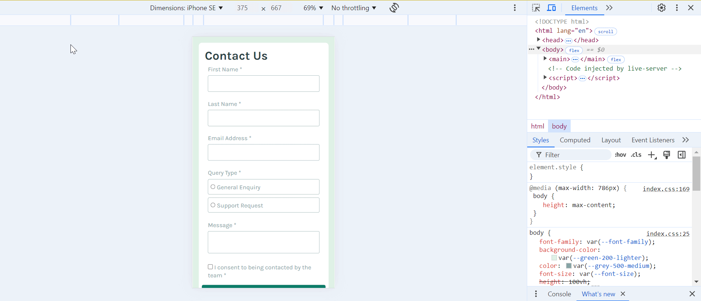

# Frontend Mentor - Contact form solution

This is a solution to the [Contact form challenge on Frontend Mentor](https://www.frontendmentor.io/challenges/contact-form--G-hYlqKJj). Frontend Mentor challenges help you improve your coding skills by building realistic projects.

## Table of contents

- [Overview](#overview)
  - [The challenge](#the-challenge)
  - [Screenshot](#screenshot)
  - [Links](#links)
- [My process](#my-process)
  - [Built with](#built-with)
  - [What I learned](#what-i-learned)
  - [Continued development](#continued-development)
  - [Useful resources](#useful-resources)
- [Author](#author)

## Overview

### The challenge

Users should be able to:

- Complete the form and see a success toast message upon successful submission
- Receive form validation messages if:
  - A required field has been missed
  - The email address is not formatted correctly
- Complete the form only using their keyboard
- Have inputs, error messages, and the success message announced on their screen reader
- View the optimal layout for the interface depending on their device's screen size
- See hover and focus states for all interactive elements on the page

### Screenshot



### Links

- Solution URL: [Add solution URL here](https://github.com/snigdha-sukun/contact-form)
- Live Site URL: [Add live site URL here](https://contact-form-coral-beta.vercel.app/)

## My process

### Built with

- Semantic HTML5 markup
- CSS custom properties
- Flexbox

### What I learned

I learned how to use `autocomplete` and `aria-describedby` for linking error message to the `<input>`:

```html
<div class="input-txt">
  <label for="email">Email Address *</label>
  <input type="email" id="email" class="input-box" name="email" autocomplete="email" aria-invalid="true" aria-describedby="email-invalid-err email-required-err" required>
  <span class="error-msg" id="email-invalid-err">Please enter a valid email address</span>
  <span class="error-msg" id="email-required-err">This field is required</span>
</div>
```

I learned how to create radio group using  html `<input>`:

```html
<div id="query-type" role="radiogroup" aria-required="true" aria-invalid="true" aria-describedby="query-type-required-err" class="query-type">
  <legend>Query Type *</legend>
  <div class="radio-options">
    <div class="option">
      <input type="radio" id="general-enquiry" name="query-type" value="general-enquiry">
      <label for="general-enquiry">General Enquiry</label>
    </div>
    <div class="option">
      <input type="radio" id="support-request" name="query-type" value="support-request">
       <label for="support-request">Support Request</label>
     </div>
   </div>
  <span class="error-msg" id="query-type-required-err">Please select a query type</span>
</div>
```

I learned how to customise the color of radio button & checkbox:

```css
input[type='radio'] {
    accent-color: var(--green-600-medium);
}

input[type='checkbox'] {
    accent-color: var(--green-600-medium);
}
```

I learned how to check if input type radio or checkbox is checked or not and show error accordingly

```js
const queryType = document.querySelector('input[name="query-type"]:checked');
if (!queryType) {
  isValid = false;
  const errorMessage = document.getElementById('query-type-required-err');
  setError(errorMessage);
}

const consent = document.querySelector('input[name="consent"]:checked');
if (!consent) {
  isValid = false;
  const errorMessage = document.getElementById('consent-required-err');
  setError(errorMessage);
}
```

### Continued development

I still need to practice the positioning an element & `@media`. I need to practice using JS for making the UI to react to different events. I also need to learn about responsive CSS, HTML5 rules & JS best practices. I need to learn more about `aria-*` tags for accessibilty.

### Useful resources

- [Grouping Controls](https://www.w3.org/WAI/tutorials/forms/grouping/) - This helped me grouping radio buttons as required in the design
- [HTML attribute: autocomplete](https://developer.mozilla.org/en-US/docs/Web/HTML/Attributes/autocomplete) - This helped me with configuring autocomplete in my forms for accessibility
- [Inclusive Inputs](https://www.ovl.design/text/inclusive-inputs/) - This helped in adding proper `aria-*` in `<input>` to connect to approporiate error messages

## Author

- Frontend Mentor - [@snigdha-sukun](https://www.frontendmentor.io/profile/snigdha-sukun)
